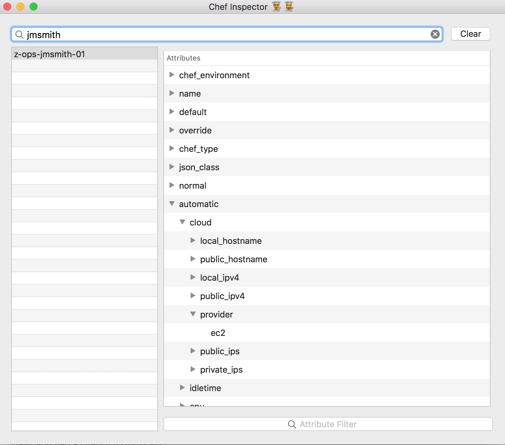

# ChefInspector

macOS app to view nodes in a [Chef installation](https://www.chef.io).

Uses your local [`~/.config.rb`](https://docs.chef.io/knife_setup.html) file for configuration thanks to [Gyutou](https://github.com/Yasumoto/Gyutou).

## About

This application will query your configured Chef server for a list of nodes, and cache them until you hit `Clear` to refresh the list.

It will filter the list of nodes based on your query string, and then query Chef for the node attributes when you click through. These attributes will be cached, and you can expand (option-click to expand an entire subtree) to view the rest of the data.

Lastly, if you need to search for a particular string/node, use the field at the bottom of the attribute display to filter based on your string query.
